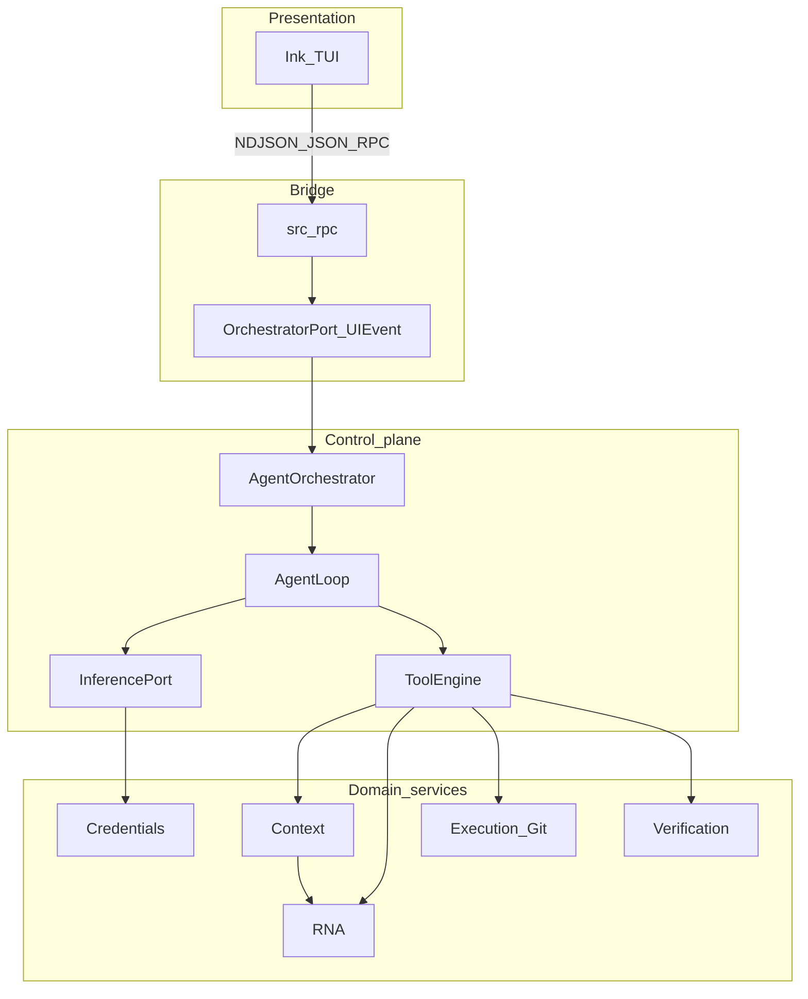

# Architecture

Neutrino is a **deterministic runtime** around an LLM agent loop. The runtime owns safety and completion; the model owns how deep to explore inside one continuous **AGENT** turn cycle. Presentation clients are thin — they render events and send commands.

## Stack

```text
Ink TUI (tui/)  --NDJSON JSON-RPC-->  Python runtime (src/rpc)
                                         └─ AgentOrchestrator
OrchestratorPort + UIEvent             (src/ports)
Agent Loop + L1–L6 prompts             (src/agent)
Orchestrator + CompletionPolicy        (src/orchestrator)
Tool Engine                            (src/tool_engine)
   └─ Capability Layer → Context / RNA / Execution / Git / Verification
Inference + Credentials                (src/inference, src/credentials)
Config                                 (src/config)
```



Living status table: root [`README.md`](../README.md).

## Layer ownership

| Layer | Path | Owns | Must not own |
|-------|------|------|--------------|
| Presentation | `tui/` | Rendering, shortcuts, overlays | Business logic, tool policy, DONE |
| Protocol | `protocol/` | NDJSON JSON-RPC schema | Runtime implementation |
| RPC bridge | `src/rpc/` | Dispatch, framing, wiring orchestrator | Agent prompt policy |
| Ports | `src/ports/` | `OrchestratorPort`, `UIEvent` contracts | Concrete TUI or LLM code |
| Orchestrator | `src/orchestrator/` | Run lifecycle, env probe, CompletionPolicy, context folding | Provider HTTP, file edits |
| Agent | `src/agent/` | Loop, L1–L6 prompts, soft state, reminders, approvals gate | Direct RNA/execution imports |
| Tool Engine | `src/tool_engine/` | Validate → dispatch → serialize tool calls | Domain algorithms |
| Inference | `src/inference/` | Chat/stream via providers | Secret storage |
| Credentials | `src/credentials/` | Resolve secrets (CLI/env/keyring/encrypted) | Model selection UX |
| RNA | `src/rna/` | Read-only repo facts | Edits, shell, planning |
| Context | `src/context/` | Bounded packages + conversation memory + `ExecutionContext` | Tool allowlists |
| Execution | `src/execution/` | Apply / rollback / shell / git | Completion decisions |
| Verification | `src/verification/` | Lint/test runners + harness policy | Prompt compilation |

## Dependency rules

1. **One-way knowledge path for repo facts through tools:** Planner/Coder never import RNA in the agent package. The agent calls `ToolEngine`; capabilities call RNA/Context/Execution.
2. **Agent import boundary:** `src/agent` must **not** import `src.rna`, `src.execution`, `src.verification`, or `src.context.manager`. Host-supplied snapshots (env, harness) come from the orchestrator.
3. **Presentation has no domain logic:** TUI reducer maps `ui.event` → view model only.
4. **Credentials stay out of TOML:** Config holds provider/model profiles; secrets resolve at runtime.
5. **Completion authority is centralized:** `CompletionPolicy` (orchestrator) decides DONE / CONTINUE / BLOCKED — not the model’s soft phase and not the Tool Engine.

## Hard vs soft control

| Kind | Mechanism | Examples |
|------|-----------|----------|
| Hard | Workflow status + CompletionPolicy | `INIT` → `AGENT` → `DONE` / `CANCELLED`; approve shell; budgets |
| Soft | Prompt Layer 5 + reminders | `DISCOVER` … `VERIFY` … `DONE` guidance; L6 nudges |

There is **no** hard PLAN → EXECUTE → VERIFY march. Soft phases are advisory.

## Related

- [HLD](02_hld.md) — subsystem responsibilities  
- [Workflow](07_workflow.md) — end-to-end codeflow  
- [Design](04_design.md) — principles behind these boundaries  
