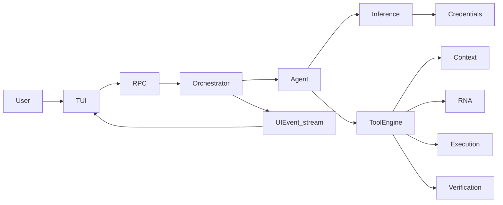

# High-level design (HLD)

Subsystem view of Neutrino: what each major piece is for, and how they collaborate on one user task.

## Subsystems

| Subsystem | Responsibility | Primary path |
|-----------|----------------|--------------|
| **Presentation** | Chronological transcript, prompt, overlays (`/auth`, `/model`, inspector) | `tui/` |
| **RPC bridge** | NDJSON JSON-RPC, map `UIEvent` → notifications, spawn orchestrator | `src/rpc/` |
| **Orchestrator** | Session run, env probe, fold context into `ExecutionContext`, CompletionPolicy | `src/orchestrator/` |
| **Agent** | Continuous inference ↔ tools loop; prompts; soft state; reminders | `src/agent/` |
| **Tool Engine** | State-gated catalog, validation, capability dispatch, LLM-friendly results | `src/tool_engine/` |
| **Inference** | Provider-agnostic chat; retries; health | `src/inference/` |
| **Credentials** | Secret resolution for providers | `src/credentials/` |
| **RNA** | On-demand, read-only repository (and optional web) facts | `src/rna/` |
| **Context** | Compose bounded packages; conversation memory; immutable run state | `src/context/` |
| **Execution / Git** | Patch apply, rollback, approved shell, commits/diff | `src/execution/` |
| **Verification** | Detect harness; run tests/lint; waive/require policy inputs | `src/verification/` |

## Collaboration for one task

1. User submits a task in the TUI → `runtime.execute`.
2. Orchestrator builds `ExecutionContext`, probes environment (git + harness), starts workflow status `AGENT`.
3. AgentLoop compiles L1–L6 system prompt, calls Inference with Tool Engine schemas for `AGENT`.
4. Model returns tool calls and/or a final message.
5. Tools hit capabilities:
   - Discover: `context.*`, `rna.*`, `research.*`, `plan.set_tasks`
   - Change: `executor.apply` / `diff` / `rollback`
   - Prove: `verify.probe`, `tests.run`, `lint.run`
   - VCS: `git.*`
   - Shell: `executor.run` (approval-gated)
6. Orchestrator folds successful context/tool side effects into `ExecutionContext` and emits `UIEvent`s.
7. On model final, **CompletionPolicy** returns DONE, CONTINUE (nudge + same history), or BLOCKED.

## Design split (who decides what)

| Concern | Owner |
|---------|--------|
| How deep to read / which tools | LLM (guided by prompts + ToolSpec when/not-when) |
| Whether the run may finish | Orchestrator `CompletionPolicy` |
| Whether shell may run | Agent approval gate + TUI approve/reject |
| What facts exist in the repo | RNA |
| What fits in context this step | Context Manager |
| How the UI looks | TUI only |

## Related package HLD-style docs

- RNA architecture: [`src/rna/docs/01_architecture.md`](../src/rna/docs/01_architecture.md)  
- Context architecture: [`src/context/docs/01_architecture.md`](../src/context/docs/01_architecture.md)  
- Tool Engine README: [`src/tool_engine/README.md`](../src/tool_engine/README.md)  

Next: [LLD](03_lld.md) for modules and types; [Workflow](07_workflow.md) for the sequence.
